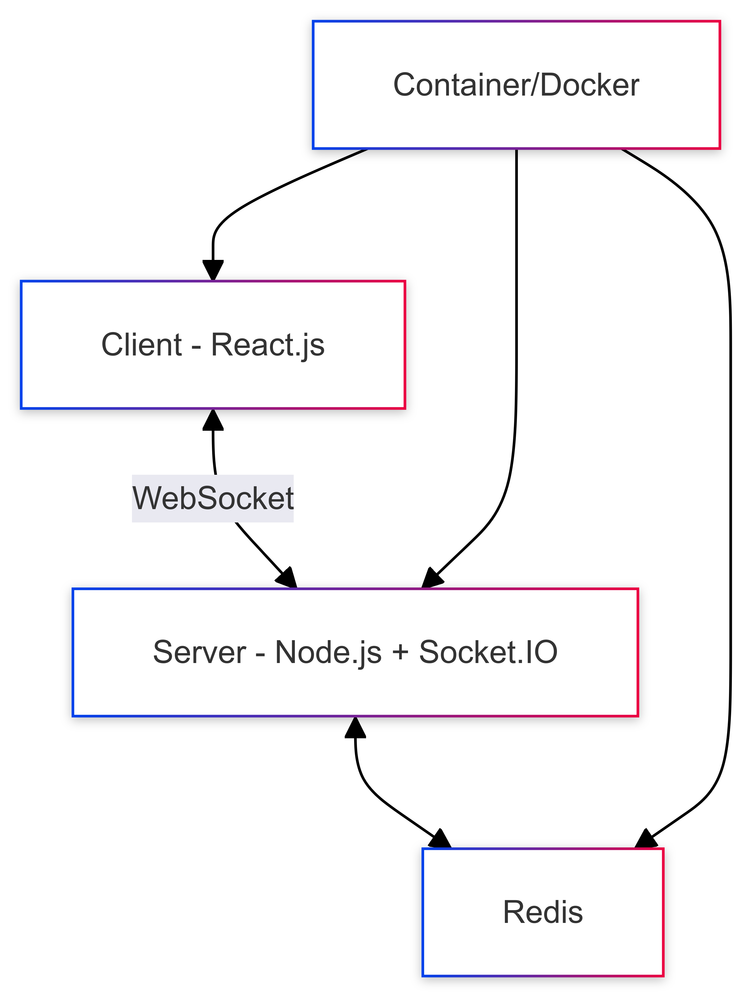
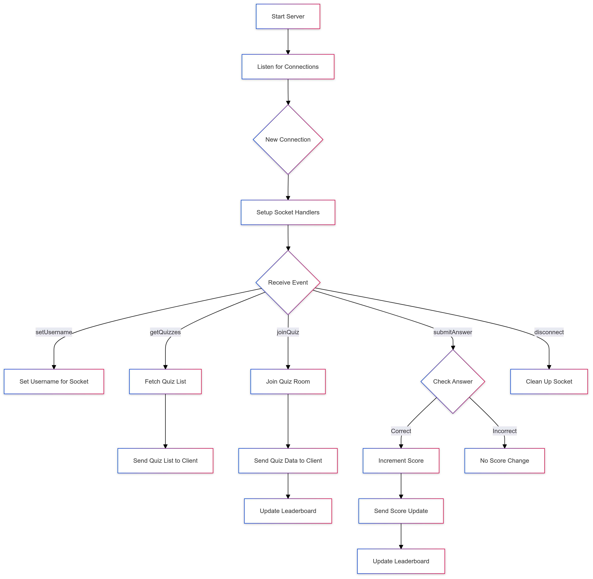

# Real-Time Vocabulary Quiz Coding Challenge

## Overview
Overview
Welcome to the Real-Time Quiz coding challenge! Your task is to create a technical solution for a real-time quiz feature for an English learning application. This feature will allow users to answer questions in real-time, compete with others, and see their scores updated live on a leaderboard.

## System Design

- ### Highlevel Arhchitecture



- ### Backend Workflow



## Detailed System Proposal

1. Client (Frontend)
    - Built with React.js and Tailwind CSS
    - Handles user interface and real-time updates
    - Communicates with the server via WebSocket (Socket.IO client)

2. Server (Backend)
    - Built with Node.js and Socket.IO
    - Manages WebSocket connections and real-time events
    - Handles quiz logic and scoring
    - Communicates with Redis for data storage and retrieval

3. Redis
    - In-memory data structure store
    - Stores quiz data, user scores, and leaderboard information
    - Enables fast read/write operations for real-time updates

4. Docker
    - Containerizes both frontend and backend applications
    - Ensures consistent environment across development and production

## Data Flow

1. User joins a quiz:
    - Client sends a "join quiz" event to the server with the quiz ID
    - Server validates the quiz ID and adds the user to the quiz session
    - Server retrieves quiz data from Redis and sends it to the client

2. User answers a question:
    - Client sends an "answer submission" event to the server
    - Server validates the answer and updates the user's score in Redis
    - Server broadcasts updated scores to all participants in the quiz

3. Leaderboard update:
    - Server retrieves updated scores from Redis
    - Server sorts scores and generates leaderboard data
    - Server broadcasts leaderboard update to all participants

## Technologies and Tools

1. Frontend:
    - React.js: A popular and efficient library for building user interfaces -> For building interactive UI components and a great choice for frontend development
    - Tailwind CSS: A utility-first CSS framework for rapid UI development -> For flexibility and ease of styling
    - Socket.IO Client: For real-time communication with the server -> One of the most popular libraries for real-time web applications

2. Backend:
    - Node.js: A JavaScript runtime for building scalable network applications
    - Socket.IO: A library that enables real-time, bidirectional communication
    - Express.js: A minimal web application framework for Node.js

3. Database:
    - Redis: An in-memory data structure store, used as a database, cache, and message broker -> For fast read/write operations and real-time updates

4. Containerization:
    - Docker: A platform for developing, shipping, and running applications in containers

## Scalability Considerations

- Use Redis pub/sub for efficient broadcasting of updates
- Implement horizontal scaling for Node.js servers behind a load balancer
- Use Redis Cluster for distributed caching and data storage

## Performance Optimizations

- Minimize data transfer by sending only necessary updates
- Use efficient data structures in Redis for quick read/write operations
- Implement debouncing on the client-side for frequent updates (e.g., typing)

## Reliability and Error Handling

- Implement reconnection logic in the Socket.IO client
- Use try-catch blocks and proper error handling in the server code
- Implement circuit breakers for Redis connections

## Monitoring and Observability (Future Improvements)

- Use logging libraries like Winston or Bunyan for comprehensive logging
- Implement health check endpoints for Docker and load balancers
- Use monitoring tools like Prometheus and Grafana for real-time metrics
- Implement unit tests and integration tests for the application

## How to run the application

Make sure to have redis installed and running on your local machine. You can download it from [here](https://redis.io/download).

- ### Backend
  - Navigate to the backend directory
  - Run `npm install`
  - Run `npm start`

- ### Frontend
- Navigate to the frontend directory
 - Run `npm install`
 - Run `npm start`

### Recommended way to run the application is to run the following command in the root directory

```bash
Or Shorter way to run the application is to run the following command in the root directory
```bash
$ docker-compose up --build
```

